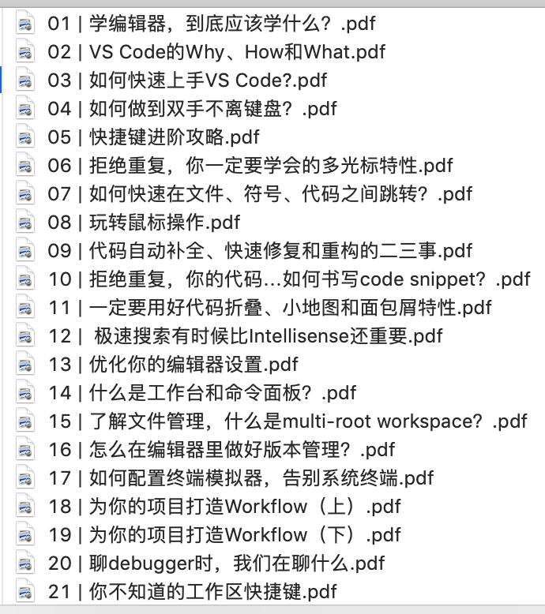
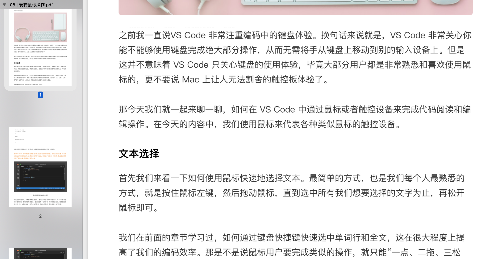

# 极客时间专栏转换为PDF

## 使用方法

在配置文件[config.js](./config,js)中修改配置所需要的信息

```js
/**
 * 需要转换为 pdf 的配置信息 
 */
module.exports = {
    url: 'https://time.geekbang.org/serv/v1/article',
    columnBaseUrl: 'https://time.geekbang.org/column/article/',
    columnName: '玩转VScode', // 专栏名称
    firstArticalId: 18053, //专栏第一篇文章的ID
    isdownloadVideo: false, // 是否下载音频
    isComment: false, // 是否导出评论
    cookie: 'cookie'
};
```

> 会自动生成一个`geektime_{{columnName}}` 的文件夹来保存导出的所有`pdf`文件, `columnName` 为上面配置的
> `firstArticalId` 这个参数最好配置专栏第一篇文章的 `ID` ，这个可以获取专栏的所有的文章,若不是第一篇文章的`ID` 则获取的是该文件以及之后的文章
> `cookie` 你在网页版登录参数的`cookie`信息
> 其他的配置项默认可以不改动

## 导出结果



